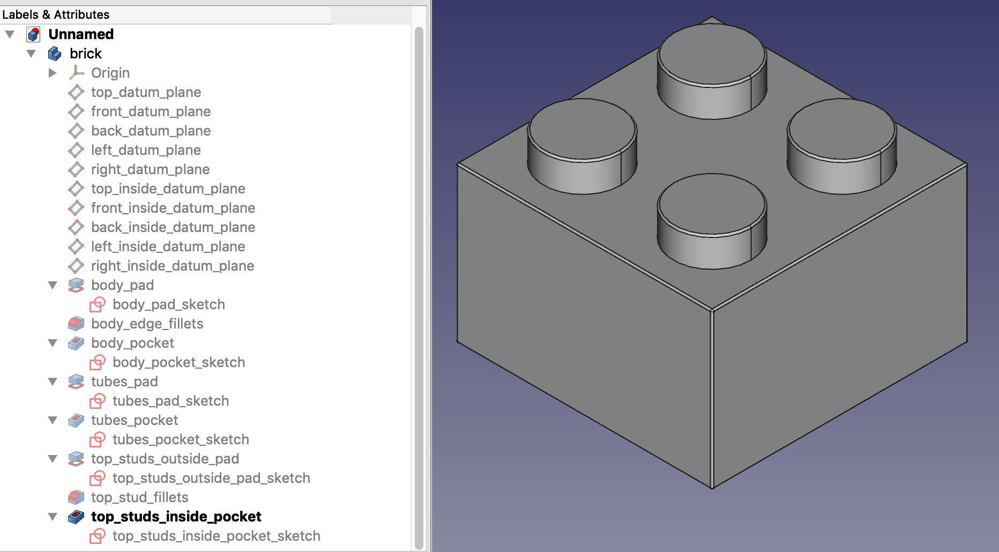
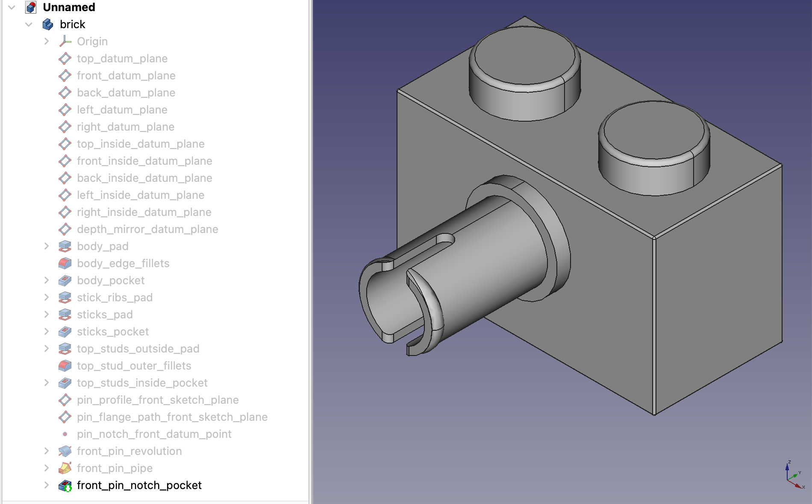
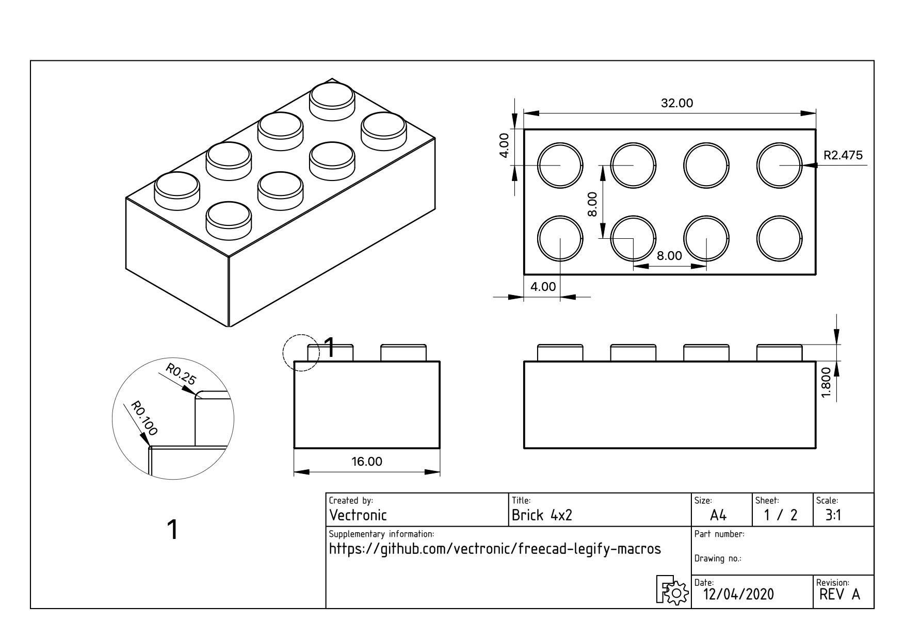
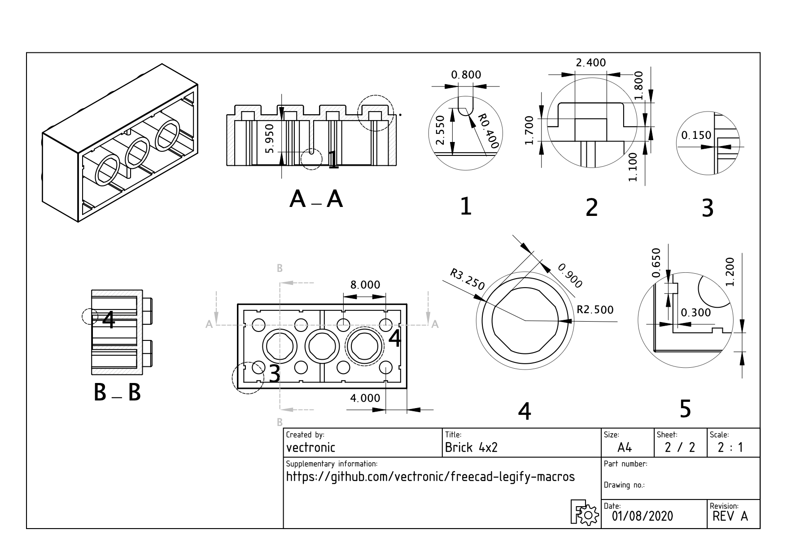

# freecad-legify-macros

Macros to generate 'plastic toy brick' models in FreeCAD

## Why?

This is a learning exercise undertaken to master the following:

* FreeCAD and concepts for parametric modelling: sketches, constraints, datum planes etc.
* Python and scripting with FreeCAD
* Detailed modelling of toy bricks
 
These all form the basis of a future planned project...

**NOTE**: This is no longer actively developed as I have learnt enough. The main lesson being that using Python scripts
to create parametric models in FreeCAD is quite possibly insane! 

## Installation

**Tested with FreeCAD version 0.20 beta**

#### MacOS

1. Clone this repository: 

    `git clone https://github.com/vectronic/freecad-legify-macros.git`
    
1. Link the cloned folder and macro file into the FreeCAD macros directory:

       ln -s <absolute path of cloned repository>/legify-brick.FCMacro <absolute path of user preferences folder>/FreeCAD/Macro/
       ln -s <absolute path of cloned repository>/Legify <absolute path of user preferences folder>/FreeCAD/Macro/

## Usage

1. Create a new document
1. Run the `legify-brick.FCMacro`
1. Modify parameters as desired in the popup dialog 
1. Click OK
1. Wait for for a lot of sketches, constraints, pads, pockets and fillets to be rendered...
1. Admire the resulting beauty! 

## TODO

- [ ] Wait for [Linear Pattern bug fix](https://tracker.freecad.org/view.php?id=4781) needed when rendering more than one technic pin
- [ ] Technic Axle Pin Rendering
- [ ] [Technic Axle Hole](https://i.pinimg.com/originals/91/c9/24/91c9241ec238fe0fef16d248e1bf4611.png) Rendering 
- [ ] [0.25mm fillet on internal brick corners](https://i.pinimg.com/originals/e7/77/9a/e7779aa3b08c93b24c257a69fdde89d9.png) 
- [ ] Determine a replacement for internal ribs if side studs with holes exist 
- [ ] Determine a replacement for tube ribs if technic holes exist
- [ ] Support [rib variation in modern 2x1 tile](https://i.pinimg.com/originals/b6/47/d5/b647d5eccf8aa9f3a6ea531c961c28ed.png) and 2x1 technic brick with 2 non-offset holes: 
- [ ] Support [modern tile with small outside pocket on bottom](https://i.pinimg.com/originals/b6/47/d5/b647d5eccf8aa9f3a6ea531c961c28ed.png) 

## Screenshots

## Credit

Initial drawing and dimensions used as reference for this work was done by [Nick Turo-Shields](https://grabcad.com/library/2x4-lego-brick-1)
