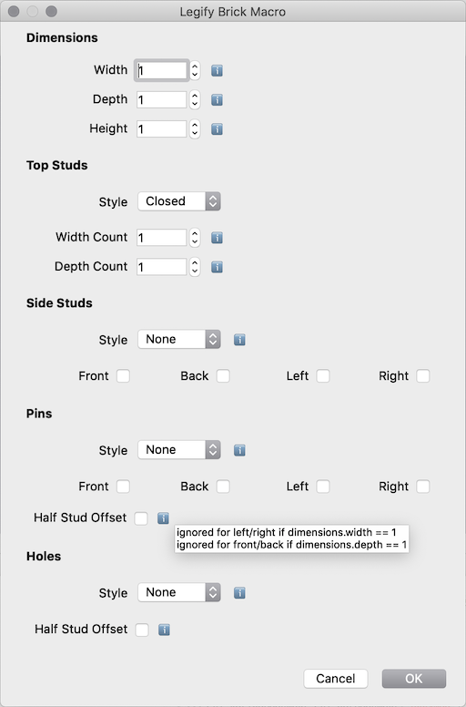
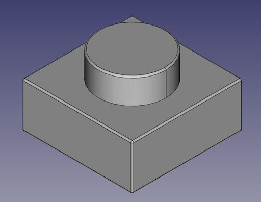
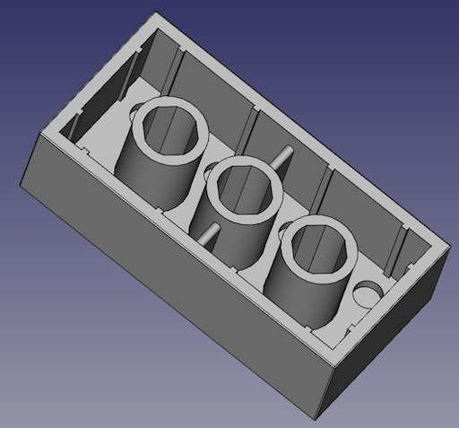
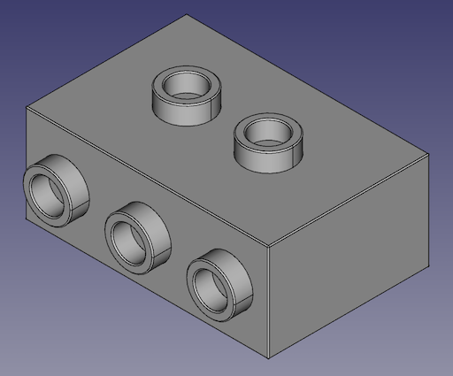
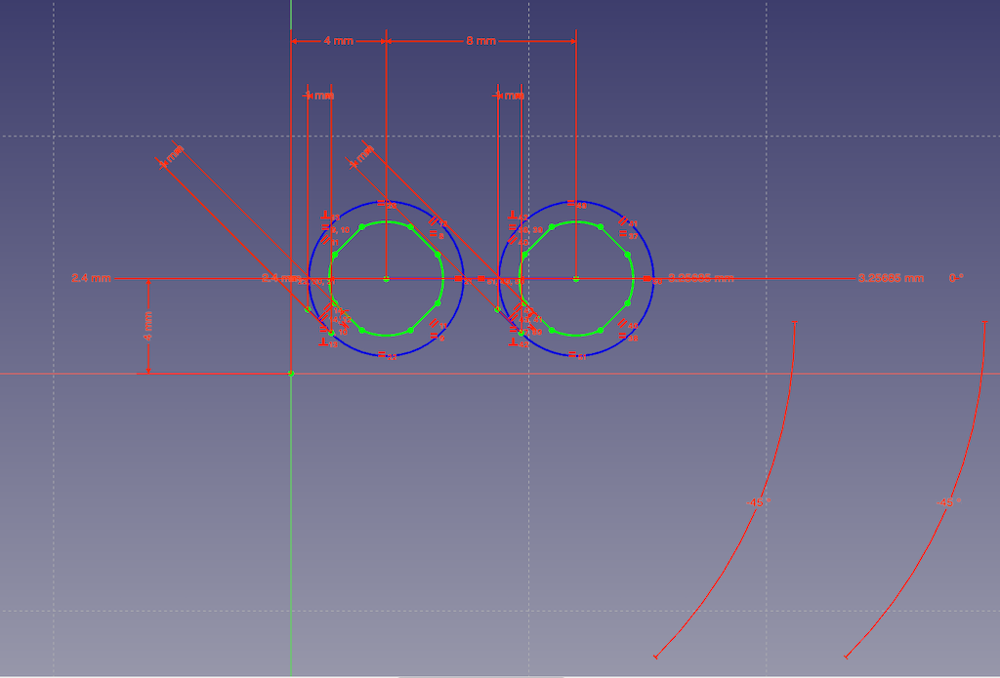

# freecad-legify-macros

Macros to generate 'plastic toy brick' models in FreeCAD

## Why?

This is a learning exercise undertaken to master the following:

* FreeCAD and concepts for parametric modelling: sketches, constraints, datum planes etc.
* Python and scripting with FreeCAD
* Detailed modelling of toy bricks
 
These all form the basis of a future planned project...
 
## Installation

**Tested only with FreeCAD version >= 0.18**

#### MacOS

1. Clone this repository: 

    `git clone https://github.com/vectronic/freecad-legify-macros.git`
    
1. Link the cloned folder and macro file into the FreeCAD macros directory:

    ```
    ln -s <local repository folder>/legify-brick.FCMacro <user preferences folder>/FreeCAD/Macro/
    ln -s <local repository folder>/Legify <user preferences folder>/FreeCAD/Macro/
    ```

## Usage

1. Create a new document
1. Run the `legify-brick.FCMacro`
1. Modify parameters as desired in the popup dialog 
1. Click OK
1. Wait for for a lot of sketches, constraints, pads, pockets and fillets to be rendered
1. Regard the resultant beauty 

## TODO

- [ ] Confirm some dimensions
- [ ] Pin Rendering
- [ ] Technic Hole Rendering
- [ ] Support modern tile where the bottom has a small outside pocket (and check if fillet is also required)
- [ ] Support rib variation in modern 2x1 tile and 2x1 technic brick with 2 non-offset holes
- [ ] Determine a replacement for internal brick ribs if side hole studs exist
- [ ] Determine if the inner edge of open studs and hole studs should be filleted

## Screenshots









